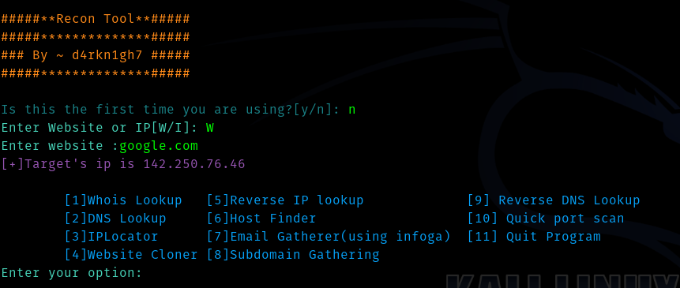

# Recon_Tool
This is a Passive Recon Tool Written in Python3

I have used some APIs of hackertarget for some functionalities. This Recon tool contains combines most of the tools needed for a passive recon . 

Usage is very simple all you need to do is run the program using 

> python3 Recon_Tool.py

Then if you are using the tool for first time then press y to install required tools .

Then Enter a website or ip and choose a option and perfrom your recon.

The features of the tool are :

* Whois Lookup
* DNS Lookup
* IP Locator
* Website Cloner
* Reverse IP Lookup
* Host Finder
* Email Gatherer (infoga)
* Subdomain Gathering
* Reverse DNS Lookup
* Quick Port Scan

